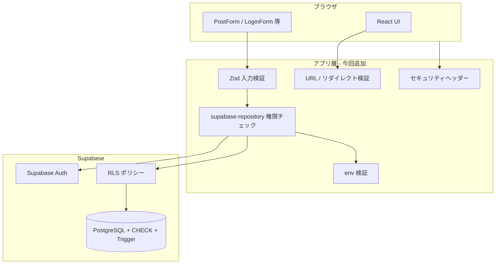

# メグリミナル セキュリティ対応メモ（学習用）

> **目的:** タスクリスト「3. セキュリティ」で実装した内容を、後から調べやすく・他のAIに質問しやすい形で整理する。  
> **関連:** [`タスクリスト.md`](./タスクリスト.md) / [`セキュリティ運用設定.md`](./セキュリティ運用設定.md)

---

## このドキュメントの使い方

| やりたいこと | 見る場所 |
|---|---|
| 用語の意味を知りたい | [用語集](#用語集) |
| 全体像を把握したい | [防御の多層構造](#防御の多層構造) |
| 各項目の「何を・なぜ・どこで」 | [3.1〜3.12 対応一覧](#31-312-対応一覧) |
| 変更ファイルを探したい | [変更ファイル索引](#変更ファイル索引) |
| 他のAIに聞くとき | [他AIへの質問テンプレート](#他aiへの質問テンプレート) |
| 本番前チェック | [`セキュリティ運用設定.md`](./セキュリティ運用設定.md) |

---

## 用語集

| 用語 | 意味 | メグリミナルでの例 |
|---|---|---|
| **認証 (Authentication)** | 「あなたは誰か」を確認すること | メール/Google ログイン |
| **認可 (Authorization)** | 「何ができるか」を制御すること | 自分の投稿だけ編集、admin だけ `/admin` |
| **RLS** | Row Level Security。DB の行ごとに読み書き権限を決める | `posts` は `user_id = auth.uid()` の人だけ更新 |
| **IDOR / BOLA** | 他人の ID を指定して操作する攻撃 | 他人の `post_id` で削除 API を叩く |
| **XSS** | 悪意あるスクリプトをページに埋め込む攻撃 | 投稿タイトルに `<script>` を入れる |
| **CSRF** | ログイン中ユーザーの意図しない操作をさせる攻撃 | 別サイトから「投稿削除」を送る |
| **Open Redirect** | ログイン後などに外部サイトへ飛ばす攻撃 | `?redirect=//evil.com` |
| **CSP** | Content-Security-Policy。ブラウザに「どこから何を読むか」を指示 | `script-src 'self'` |
| **HSTS** | HTTPS 固定ヘッダー。以後 HTTP アクセスを防ぐ | 本番のみ `Strict-Transport-Security` |
| **Defense in Depth** | 1 箇所だけでなく複数層で守る考え方 | RLS + アプリ層 + DB 制約 |
| **anon key** | ブラウザに載せてよい Supabase 公開キー | `NEXT_PUBLIC_SUPABASE_ANON_KEY` |
| **service_role key** | 管理者権限キー。**絶対にクライアントに載せない** | RLS をバイパスできる |

---

## 防御の多層構造

メグリミナルは「ブラウザ → Supabase 直接」の構成。Server Action で書き込みを全部包んでいないため、**DB 層 (RLS) が最後の砦**になる。



**覚え方:** 上ほど「ユーザーが触れる層」、下ほど「最終的に必ず効く層」。

---

## 3.1〜3.12 対応一覧

### 3.1 パスワードハッシュ `[x]`（もともと対応済み）

| 項目 | 内容 |
|---|---|
| **脅威** | パスワード平文保存 → DB 漏洩で全アカウント危険 |
| **対策** | Supabase Auth に委譲。アプリは平文を保存しない |
| **該当** | `SupabaseAuthProvider.tsx` の `signUp` / `signInWithPassword` |
| **確認** | `profiles` テーブルに password カラムがないこと |

---

### 3.2 HTTPS `[~]`（一部コード、一部運用）

| 項目 | 内容 |
|---|---|
| **脅威** | HTTP 通信は盗聴・改ざん可能 |
| **コード側** | 本番のみ HSTS ヘッダー（`next.config.ts`） |
| **運用側（未完了）** | Vercel 等で HTTPS 強制、カスタムドメイン SSL |
| **該当ファイル** | `next.config.ts` |
| **確認方法** | 本番 URL で `curl -I https://...` → `Strict-Transport-Security` が返る |

```ts
// next.config.ts（本番のみ）
Strict-Transport-Security: max-age=63072000; includeSubDomains; preload
```

**なぜ `[~]` か:** ローカル開発は HTTP のまま。本番ホスティング設定はデプロイ時に人間が確認する必要がある。

---

### 3.3 CSRF `[x]`

| 項目 | 内容 |
|---|---|
| **脅威** | ログイン中ユーザーに、知らないうちに POST させる |
| **現状** | 状態変更する**独自 API Route / Server Action がない** |
| **書き込み経路** | ブラウザ → Supabase REST（アクセストークン付き） |
| **対策** | Supabase の Bearer トークン + RLS。Cookie だけでは書き込めない |
| **将来** | 独自 POST API を足すなら CSRF トークン必須 → [`セキュリティ運用設定.md`](./セキュリティ運用設定.md) |

**ポイント:** CSRF は「Cookie 認証のフォーム POST」で起きやすい。今の構成は Supabase トークン主体なのでリスクは低い。

---

### 3.4 XSS `[x]`

| 項目 | 内容 |
|---|---|
| **脅威** | ユーザー入力が HTML/JS として実行される |
| **対策 1** | React は `{text}` を自動エスケープ（`dangerouslySetInnerHTML` 未使用） |
| **対策 2** | CSP ヘッダーで外部スクリプト実行を制限 |
| **対策 3** | 投稿 URL・アバター URL を `http:` / `https:` のみ許可 |
| **該当ファイル** | `next.config.ts`, `lib/validation/data.ts`, `lib/avatars/index.ts`, `components/post/PostDetail.tsx` |

**具体例（投稿リンク）:**

```ts
// 保存前: Zod で http(s) のみ
url: httpUrlSchema.optional()

// 表示前: 危険な値はリンクにしない
const safePostUrl = getSafeHttpUrl(post.url);
{safePostUrl && <a href={safePostUrl}>...</a>}
```

**なぜ表示時も検証するか:** 過去データや DB 直接操作で `javascript:` URL が入っていた場合の保険。

---

### 3.5 SQL Injection `[x]`（もともと対応済み）

| 項目 | 内容 |
|---|---|
| **脅威** | SQL 文にユーザー入力を連結 → DB 乗っ取り |
| **対策** | Supabase クライアントはパラメータ化クエリ + RLS |
| **該当** | `lib/data/supabase-repository.ts` の `.eq()`, `.insert()` 等 |
| **やってはいけない例** | `` `SELECT * FROM posts WHERE id = '${id}'` `` のような文字列連結 |

---

### 3.6 IDOR / BOLA `[x]`

| 項目 | 内容 |
|---|---|
| **脅威** | 他人の `post_id` / `user_id` を指定して更新・削除 |
| **DB 層** | RLS: `auth.uid() = user_id` の行だけ更新・削除 |
| **アプリ層（今回追加）** | repository で操作前に所有者・admin を確認 |

**追加した 3 つの関数（`supabase-repository.ts`）:**

| 関数 | 役割 |
|---|---|
| `getAuthenticatedUserId()` | 今ログイン中のユーザー ID を取得 |
| `assertActingAs(userId)` | 「自分として」操作しているか確認（プロフィール更新等） |
| `assertCanChangePosts(ids, allowAdmin?)` | 投稿の所有者 or admin か確認 |

**適用箇所:**

- `createPost` → `assertActingAs(userId)`
- `updatePost` / `deletePost` → `assertCanChangePosts`
- `deletePosts`（admin 一括削除）→ `allowAdmin: true`
- `updateUser` / `hidePost` / `unhidePost` → `assertActingAs`

**Defense in Depth の例:**

```
攻撃者が DevTools から他人の post_id で delete を呼ぶ
  → アプリ層: assertCanChangePosts で拒否
  → 万が一すり抜けても RLS: auth.uid() ≠ user_id で拒否
```

---

### 3.7 入力値検証 `[x]`

| 項目 | 内容 |
|---|---|
| **以前** | HTML の `maxLength` だけ（ブラウザを迂回すれば無効） |
| **今回** | Zod（アプリ層）+ CHECK 制約（DB 層） |

**Zod スキーマ（`lib/validation/data.ts`）:**

| スキーマ | 主なルール |
|---|---|
| `createPostSchema` | title 1〜100, description 1〜1000, url は http(s) |
| `updatePostSchema` | 部分更新可、url は null で削除可 |
| `updateProfileSchema` | name 1〜50, avatarUrl は `/path` または http(s) |

**DB 制約（`supabase/migrations/20260822120000_security_constraints.sql`）:**

- `profiles_name_length`: 名前 1〜50 文字
- `profiles_avatar_url_safe`: アバター URL の形式
- `posts_title_length` / `posts_description_length` / `posts_url_safe`

**なぜ 2 層必要か:**

| 層 | 守れる相手 |
|---|---|
| Zod（アプリ） | 通常 UI からの入力、早いエラーメッセージ |
| CHECK（DB） | DevTools / curl で Supabase API を直接叩く人 |

---

### 3.8 Secrets 管理 `[x]`

| 項目 | 内容 |
|---|---|
| **脅威** | `service_role` key がブラウザ bundle に入る → RLS 全 bypass |
| **対策** | 起動時に env を検証（`lib/supabase/env.ts`） |

**検証内容:**

1. `NEXT_PUBLIC_SUPABASE_URL` / `ANON_KEY` が存在する
2. URL が HTTPS（localhost の http は例外）
3. anon key の長さが妥当
4. JWT を decode して `role === 'service_role'` なら拒否
5. `sb_secret_` で始まるキーも拒否

**使用箇所:** `client.ts`, `server.ts`, `middleware.ts`, `public.ts` すべて `getSupabasePublicEnv()` 経由

**覚え方:**

```
NEXT_PUBLIC_*  → ブラウザに載る → anon key のみ
service_role   → サーバー専用     → 絶対 NEXT_PUBLIC_ にしない
```

---

### 3.9 Session / Token 管理 `[x]`

| 項目 | 内容 |
|---|---|
| **仕組み** | Supabase SSR Cookie + middleware でセッション refresh |
| **ログアウト** | `signOut({ scope: 'global' })` で全端末の refresh token 失効 |
| **方針文書** | JWT 1時間、refresh rotation → [`セキュリティ運用設定.md`](./セキュリティ運用設定.md) |

**該当ファイル:**

- `lib/supabase/middleware.ts` … 各リクエストで `getUser()` してセッション更新
- `components/providers/SupabaseAuthProvider.tsx` … ログアウト処理

---

### 3.10 レート制限 `[~]`

| 項目 | 内容 |
|---|---|
| **投稿頻度** | DB trigger で「大カテゴリごと 7 日 1 回」を強制 `[x]` |
| **ログイン試行** | Supabase Dashboard の rate limit 設定 `[ ]` 運用で確認 |

**DB trigger の仕組み:**

```sql
-- 同時投稿（レースコンディション）も防ぐ
pg_advisory_xact_lock(user_id + major_category_id)

-- 7 日以内に同カテゴリ投稿があれば拒否
if exists (... created_at > now() - interval '7 days') then raise exception
```

**なぜ advisory lock か:** 2 つのタブから同時に投稿ボタンを押したとき、両方とも「直近投稿なし」と判定されるのを防ぐ。

---

### 3.11 セキュリティヘッダー `[x]`

| ヘッダー | 役割 |
|---|---|
| `Content-Security-Policy` | スクリプト・画像・接続先を制限 |
| `X-Frame-Options: DENY` | クリックジャッキング防止（iframe 埋め込み拒否） |
| `X-Content-Type-Options: nosniff` | MIME スニッフィング防止 |
| `Referrer-Policy` | 外部に URL 情報を漏らしすぎない |
| `Permissions-Policy` | カメラ・マイク等を無効化 |
| `Strict-Transport-Security` | 本番のみ HTTPS 固定 |

**該当:** `next.config.ts` の `headers()` 関数

---

### 3.12 依存パッケージ監査 `[x]`

| 項目 | 内容 |
|---|---|
| **脅威** | ライブラリの既知脆弱性（postcss, sharp, nanoid 等） |
| **対策** | Next.js 16.3.2 へ更新、`npm audit fix` |
| **追加 script** | `npm run audit`, `npm run audit:prod` |
| **確認** | `npm run audit` → `found 0 vulnerabilities` |

---

## 変更ファイル索引

| ファイル | 役割 |
|---|---|
| `next.config.ts` | セキュリティヘッダー（CSP, HSTS 等） |
| `lib/auth/safe-redirect.ts` | オープンリダイレクト防止 |
| `lib/validation/data.ts` | Zod スキーマ + 安全 URL 取得 |
| `lib/data/supabase-repository.ts` | 入力検証 + IDOR チェック |
| `lib/supabase/env.ts` | 環境変数・秘密鍵混入チェック |
| `lib/supabase/client.ts` 等 | env 検証経由に統一 |
| `lib/avatars/index.ts` | アバター URL の安全判定 |
| `components/post/PostDetail.tsx` | 投稿リンクの表示時検証 |
| `components/auth/LoginForm.tsx` | ログイン後 redirect 検証 |
| `components/providers/SupabaseAuthProvider.tsx` | OAuth redirect + 全端末ログアウト |
| `app/auth/callback/route.ts` | OAuth 完了後 redirect 検証 |
| `supabase/migrations/20260822120000_security_constraints.sql` | DB CHECK + 投稿頻度 trigger |
| `package.json` | audit script, Node >=22, zod 追加 |
| `設計書/セキュリティ運用設定.md` | 本番 Dashboard 設定メモ |

---

## データの流れ（投稿作成の例）

理解のため、1 操作が各層をどう通るか。

```
1. ユーザーが PostForm で「投稿」クリック
2. [クライアント] maxLength でざっくり制限（UX）
3. [Zod] createPostSchema.parse(input)
       → title 長さ、url が http(s) か等
4. [Repository] assertActingAs(userId)
       → ログインユーザーと userId が一致するか
5. [Supabase Auth] アクセストークン付きで REST 呼び出し
6. [RLS] posts_insert_own: auth.uid() = user_id か
7. [DB Trigger] enforce_post_frequency
       → 7日制限 + advisory lock
8. [DB CHECK] title/description/url の制約
9. 成功 → PostDetail 表示時に getSafeHttpUrl でリンク化
```

---

## まだ `[~]` / 未完了のもの

| 項目 | 状態 | やること |
|---|---|---|
| 3.2 HTTPS | `[~]` | 本番デプロイ後、HTTP→HTTPS リダイレクト確認 |
| 3.10 ログイン rate limit | `[~]` | Supabase Dashboard で Auth rate limit 確認 |
| DB migration 適用 | 要確認 | `20260822120000_security_constraints.sql` を本番 Supabase に実行 |

**migration 適用手順（ローカル / 本番）:**

```bash
# ローカル Supabase
npm run supabase:start
npx supabase db push

# または Supabase Dashboard > SQL Editor に migration 内容を貼り付け実行
```

---

## 確認コマンド集

```bash
# 脆弱性チェック
npm run audit

# 本番ビルド（型エラー確認）
npm run build

# 変更ファイルだけ lint
npx eslint "lib/validation/data.ts" "lib/data/supabase-repository.ts" "next.config.ts"

# 本番ヘッダー確認（デプロイ後）
curl -I https://your-domain.com
```

---

## 他AIへの質問テンプレート

コピペして使える。`[ ]` 部分を埋める。

### 全体理解

```
メグリミナル（Next.js + Supabase）のセキュリティ構成を説明してください。
ブラウザから Supabase に直接書き込む構成で、RLS + repository 層 + Zod + DB CHECK/trigger
の多層防御を採用しています。設計書/セキュリティ対応メモ.md を前提に、
弱点と改善案を教えてください。
```

### 特定項目

```
メグリミナルの IDOR 対策について教えてください。
RLS（posts_update_own）に加え、lib/data/supabase-repository.ts の
assertCanChangePosts / assertActingAs も入れています。
この二重チェックで足りないケースはありますか？
```

```
CSP 設定（next.config.ts）が Supabase / Google OAuth / 外部アバター URL と
競合しないかレビューしてください。現在の connect-src は 'self' https: wss: です。
```

```
supabase/migrations/20260822120000_security_constraints.sql の
enforce_post_frequency trigger について、レースコンディション対策として
pg_advisory_xact_lock を使っています。この設計の問題点は？
```

### 運用

```
本番リリース前のセキュリティチェックリストを、
メグリミナルの設計書/セキュリティ運用設定.md と
設計書/セキュリティ対応メモ.md を前提に作ってください。
```

---

## よくある疑問（FAQ）

### Q. RLS があるのに、アプリ層でもチェックする意味は？

**A.** Defense in Depth（多層防御）。RLS だけでも安全だが、アプリ層で先に弾くと:

- エラーメッセージをユーザー向けに出せる
- RLS 設定ミスがあっても第 2 防壁になる
- 将来 Server Action に移行するときの土台になる

### Q. `NEXT_PUBLIC_` って何？

**A.** Next.js では `NEXT_PUBLIC_` 付き env は**ブラウザの JavaScript に埋め込まれる**。
だから anon key だけ載せ、service_role は絶対載せない。

### Q. Zod と HTML maxLength、どっちが効く？

**A.** 両方意味がある。

- `maxLength` … 入力中の UX（早く気づける）
- Zod … 改ざんされたリクエストを弾く（本当の防御）
- DB CHECK … API 直叩きも弾く（最後の防御）

### Q. Open Redirect の `//evil.com` 問題とは？

**A.** `/` で始まるかだけ見ると `//evil.com` も通る。ブラウザは `//` を「別ドメインの URL」と解釈する。
`getSafeRedirectPath` は `/` 始まり **かつ** `//` 禁止 **かつ** `\` 禁止で防ぐ。

### Q. セキュリティヘッダーは DevTools でどう見る？

**A.** ブラウザ → Network → 任意の HTML レスポンス → Response Headers。
`content-security-policy`, `strict-transport-security` 等を確認。

---

## 更新履歴

| 日付 | 内容 |
|---|---|
| 2026-08-22 | タスクリスト 3 対応に伴い初版作成 |
