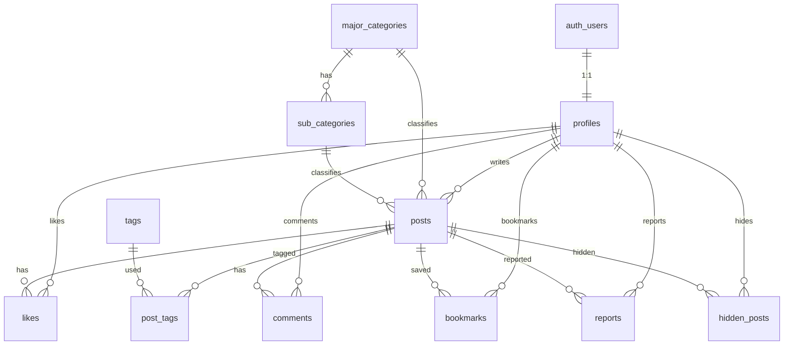

# テーブル定義書

現行機能（Local モードで動いている画面・型・Repository）を正として、過不足を確認したうえで確定する。  
検索条件・投稿属性・ユーザ属性は、列追加を最小限に抑えつつ JSONB で伸ばせる形にする。

- **DBMS**: PostgreSQL（Supabase）
- **認証**: Supabase Auth（`auth.users`）と `profiles` を 1:1 で連携
- **権限の正本**: Row Level Security（RLS）のみ。書き込み用の自前 API は作らない。画面のボタン非表示は UX 用
- **スキーマ SQL**: `supabase/schema.sql`

---

## 1. 現行機能との突合

### 1.1. 実装済みでテーブルが必要なもの

| 機能 | 画面 / 型 | テーブル | 判定 |
|---|---|---|---|
| 認証・表示名・アバター・権限 | signup / login / profile / admin | `profiles` | 必要。email・password は `auth.users` |
| 大ジャンル | 投稿・検索・管理・ランキング | `major_categories` | 必要 |
| 中ジャンル | 投稿・検索 | `sub_categories` | 必要 |
| 横断タグ | 検索 UI・`Post.tagIds` | `tags` / `post_tags` | 必要（投稿フォームへのタグ UI は未接続だが型・検索は存在） |
| 投稿 CRUD・週1制限 | create / edit / 詳細 | `posts` | 必要。制限は `user_id + major_category_id + created_at` から算出 |
| いいね・ランキング | 詳細・ランキング | `likes`（`posts.like_count` はキャッシュ） | 必要。ランキング専用テーブルは不要 |
| ブックマーク | `/bookmarks` | `bookmarks` | **不足**。型・画面はあるが定義・`schema.sql` に未記載 |
| 通報 | 投稿詳細・admin | `reports` | **不足**。同上 |
| 個別非表示 | 投稿詳細 | `hidden_posts` | **不足**。同上 |
| コメント | 型・Repository・画面設計 | `comments` | 残す。UI は未接続だが削除しない |

### 1.2. テーブルにしないもの（過剰になりやすい）

| 候補 | 理由 |
|---|---|
| ランキングテーブル | `likes` / `posts` の期間集計で足りる |
| 投稿制限テーブル | 直近7日の `posts` 件数で判定。必要なら RPC で強制 |
| 検索条件マスタ | 検索はクエリ時フィルタ。条件種別を行で持つと硬くなる |
| メール・パスワード | `auth.users` が正本 |
| i18n 文言 | `messages/*.ts`。ユーザの表示言語だけ `profiles.locale` に持つ |

### 1.3. 現行に対する列の過不足

| 対象 | 不足 | 過剰 |
|---|---|---|
| `profiles` | `bio` / `locale` / `settings` / `updated_at`（プロフィール拡張用） | なし。email を持たないのは正しい |
| `posts` | `attrs` / `updated_at`（編集あり）。キーワード検索用の trigram インデックス | なし。カテゴリ別子テーブル（書籍専用など）は作らない |
| 検索 | 専用テーブルは不要。`posts` の列 + `attrs` + trigram で足す | 検索履歴テーブルは現状スコープ外 |
| `comments` | `updated_at`（RLS に update がある） | なし |

---

## 2. 拡張方針

列を増やさずに属性を足せるようにする。よく使うものだけ列にし、それ以外は JSONB に入れる。

### 2.1. 投稿情報（`posts.attrs`）

今の固定項目は `title` / `description` / `url` / ジャンル / タグ。  
ジャンル固有の情報（書籍の著者・ISBN、動画ID、スポットの住所など）は `attrs JSONB` に入れる。

```json
{
  "author": "劉慈欣",
  "isbn": "978-4-15-011000-0",
  "year": 2008
}
```

- アプリ側でジャンルごとのキー規約を持つ（最初はコード定義で足りる）
- 管理画面から項目を増やしたくなったら、そのとき `category_attr_defs` を足す（今は作らない）
- 下書き・サムネは初期スコープ外。必要なら後から `status` / `thumbnail_url` を列追加する

### 2.2. ユーザ情報（`profiles.settings`）

今の固定項目は `name` / `avatar_url` / `role`。  
自己紹介・表示言語は列にし、通知やテーマなどは `settings JSONB` に入れる。

```json
{
  "theme": "system"
}
```

- email は `auth.users` のまま（重複させない）
- フォロー・SNS リンクは今の機能にないのでテーブル化しない。リンクが必要なら `settings` か別テーブルで後付け

### 2.3. 検索方法

検索条件そのものはテーブルにしない。フィルタの足し方を揃える。

| 種類 | 今ある条件 | データの持ち方 |
|---|---|---|
| 第一級 | 大ジャンル、中ジャンル、タグ AND/OR、投稿日、並び順 | 既存列 / `post_tags` / `created_at` |
| キーワード | タイトル・本文・URL・投稿者名 | `pg_trgm`（日本語の部分一致向き。`tsvector` は日本語に弱いので主手段にしない） |
| 追加属性 | 未実装（著者、年号、場所など） | `posts.attrs` を GIN で引き、ジャンルに応じたキーで絞る |

新しい検索の足し方:

1. みなに使う条件 → 列または関連テーブルを足す（タグがこのパターン）
2. ジャンル限定・たまに使う条件 → `attrs` のキーを足すだけ（マイグレーション不要）
3. 保存検索・検索履歴 → 必要になったら `saved_searches` を足す（今は作らない）

---

## 3. テーブル一覧



| 物理名 | 論理名 | 概要 |
|---|---|---|
| profiles | プロフィール | 表示名・アバター・権限・拡張設定 |
| major_categories | 大カテゴリ | YouTube、本、映画など |
| sub_categories | 中・小カテゴリ | 大カテゴリ配下の細分化 |
| tags | タグ | 横断タグ（SF、ミステリなど） |
| posts | 投稿 | おすすめ投稿本体 + 拡張属性 |
| post_tags | 投稿タグ | 投稿とタグの多対多 |
| likes | いいね | 投稿へのいいね（ランキング集計の正本） |
| comments | コメント | 投稿へのコメント |
| bookmarks | ブックマーク | ユーザーが保存した投稿 |
| reports | 通報 | 不適切投稿の通報 |
| hidden_posts | 非表示 | ユーザー個別の投稿非表示 |

---

## 4. テーブル定義

### 4.1. profiles

`auth.users` と 1:1。登録時トリガーで自動作成。

| フィールド物理名 | フィールド論理名 | データ型 | NULL | PK | FK | デフォルト値 | 備考 |
|---|---|---|---|---|---|---|---|
| id | ユーザーID | UUID | NOT NULL | Y | auth.users(id) | | ON DELETE CASCADE |
| name | 表示名 | TEXT | NOT NULL | | | | signup の metadata から設定 |
| avatar_url | アバター | TEXT | NULL | | | '👤' | 絵文字 or URL |
| bio | 自己紹介 | TEXT | NULL | | | | 将来のプロフィール拡張 |
| locale | 表示言語 | TEXT | NOT NULL | | | 'ja' | `ja` / `en`。アプリ i18n と対応 |
| role | 権限 | TEXT | NOT NULL | | | 'user' | `user` / `admin`。CHECK 制約 |
| settings | 拡張設定 | JSONB | NOT NULL | | | '{}' | テーマ等。キー追加はアプリ規約 |
| created_at | 作成日時 | TIMESTAMPTZ | NOT NULL | | | now() | |
| updated_at | 更新日時 | TIMESTAMPTZ | NOT NULL | | | now() | プロフィール編集時に更新 |

### 4.2. major_categories

| フィールド物理名 | フィールド論理名 | データ型 | NULL | PK | FK | デフォルト値 | 備考 |
|---|---|---|---|---|---|---|---|
| id | カテゴリID | TEXT | NOT NULL | Y | | | スラッグ（youtube 等） |
| name | カテゴリ名 | TEXT | NOT NULL | | | | |
| icon | アイコン名 | TEXT | NULL | | | | Lucide アイコン名 |
| sort_order | 表示順 | INT | NOT NULL | | | 0 | |
| is_active | 有効フラグ | BOOLEAN | NOT NULL | | | true | |

### 4.3. sub_categories

| フィールド物理名 | フィールド論理名 | データ型 | NULL | PK | FK | デフォルト値 | 備考 |
|---|---|---|---|---|---|---|---|
| id | カテゴリID | TEXT | NOT NULL | Y | | | スラッグ（books-novel 等） |
| major_category_id | 大カテゴリ | TEXT | NOT NULL | | major_categories(id) | | ON DELETE RESTRICT（投稿が残るため） |
| name | カテゴリ名 | TEXT | NOT NULL | | | | |
| sort_order | 表示順 | INT | NOT NULL | | | 0 | |
| is_active | 有効フラグ | BOOLEAN | NOT NULL | | | true | |

### 4.4. tags

| フィールド物理名 | フィールド論理名 | データ型 | NULL | PK | FK | デフォルト値 | 備考 |
|---|---|---|---|---|---|---|---|
| id | タグID | TEXT | NOT NULL | Y | | | スラッグ |
| name | タグ名 | TEXT | NOT NULL | | | | |
| sort_order | 表示順 | INT | NOT NULL | | | 0 | |
| is_active | 有効フラグ | BOOLEAN | NOT NULL | | | true | |

### 4.5. posts

| フィールド物理名 | フィールド論理名 | データ型 | NULL | PK | FK | デフォルト値 | 備考 |
|---|---|---|---|---|---|---|---|
| id | 投稿ID | UUID | NOT NULL | Y | | gen_random_uuid() | |
| user_id | 投稿者ID | UUID | NULL 可 | | profiles(id) | | 掲示板モードの匿名投稿は NULL。ログインユーザーは ON DELETE CASCADE。週1制限の単位の一端 |
| major_category_id | 大カテゴリ | TEXT | NOT NULL | | major_categories(id) | | 週1制限の単位 |
| sub_category_id | 中カテゴリ | TEXT | NULL | | sub_categories(id) | | 任意。検索の細分化用 |
| title | タイトル | TEXT | NOT NULL | | | | 最大100文字はアプリ側 |
| description | 説明 | TEXT | NOT NULL | | | | 最大1000文字はアプリ側 |
| url | リンクURL | TEXT | NULL | | | | |
| attrs | 拡張属性 | JSONB | NOT NULL | | | '{}' | ジャンル固有項目。GIN インデックス |
| like_count | いいね数 | INT | NOT NULL | | | 0 | `likes` からの非正規化キャッシュ |
| created_at | 投稿日時 | TIMESTAMPTZ | NOT NULL | | | now() | 検索期間・ランキング・週1制限 |
| updated_at | 更新日時 | TIMESTAMPTZ | NOT NULL | | | now() | 編集時に更新 |

制約・補足:

- `sub_category_id` がある場合、その `major_category_id` が投稿の大ジャンルと一致すること（トリガーまたはアプリで保証）
- 週1制限は「同一 `user_id` + `major_category_id` で直近7日に1件」を RPC / トリガーで強制する。専用テーブルは持たない
- キーワード検索用に `title` / `description` / `url` へ `pg_trgm` GIN を張る

### 4.6. post_tags

| フィールド物理名 | フィールド論理名 | データ型 | NULL | PK | FK | デフォルト値 | 備考 |
|---|---|---|---|---|---|---|---|
| post_id | 投稿ID | UUID | NOT NULL | Y | posts(id) | | ON DELETE CASCADE |
| tag_id | タグID | TEXT | NOT NULL | Y | tags(id) | | ON DELETE RESTRICT |

### 4.7. likes

| フィールド物理名 | フィールド論理名 | データ型 | NULL | PK | FK | デフォルト値 | 備考 |
|---|---|---|---|---|---|---|---|
| id | いいねID | UUID | NOT NULL | Y | | gen_random_uuid() | |
| post_id | 投稿ID | UUID | NOT NULL | | posts(id) | | ON DELETE CASCADE |
| user_id | ユーザーID | UUID | NULL 可 | | profiles(id) | | 匿名いいねは NULL。UNIQUE は NULL 同士を重複とみなさない |
| created_at | 作成日時 | TIMESTAMPTZ | NOT NULL | | | now() | 期間ランキングの集計キー |

UNIQUE (`post_id`, `user_id`)。  
`posts.like_count` はトリガーで増減させる。

### 4.8. comments

| フィールド物理名 | フィールド論理名 | データ型 | NULL | PK | FK | デフォルト値 | 備考 |
|---|---|---|---|---|---|---|---|
| id | コメントID | UUID | NOT NULL | Y | | gen_random_uuid() | |
| post_id | 投稿ID | UUID | NOT NULL | | posts(id) | | ON DELETE CASCADE |
| user_id | ユーザーID | UUID | NULL 可 | | profiles(id) | | 匿名コメントは NULL |
| body | 本文 | TEXT | NOT NULL | | | | |
| created_at | 作成日時 | TIMESTAMPTZ | NOT NULL | | | now() | |
| updated_at | 更新日時 | TIMESTAMPTZ | NOT NULL | | | now() | |

### 4.9. bookmarks

| フィールド物理名 | フィールド論理名 | データ型 | NULL | PK | FK | デフォルト値 | 備考 |
|---|---|---|---|---|---|---|---|
| id | ブックマークID | UUID | NOT NULL | Y | | gen_random_uuid() | |
| user_id | ユーザーID | UUID | NOT NULL | | profiles(id) | | ON DELETE CASCADE |
| post_id | 投稿ID | UUID | NOT NULL | | posts(id) | | ON DELETE CASCADE |
| created_at | 作成日時 | TIMESTAMPTZ | NOT NULL | | | now() | |

UNIQUE (`user_id`, `post_id`)。

### 4.10. reports

| フィールド物理名 | フィールド論理名 | データ型 | NULL | PK | FK | デフォルト値 | 備考 |
|---|---|---|---|---|---|---|---|
| id | 通報ID | UUID | NOT NULL | Y | | gen_random_uuid() | |
| post_id | 投稿ID | UUID | NOT NULL | | posts(id) | | ON DELETE CASCADE |
| reporter_id | 通報者ID | UUID | NOT NULL | | profiles(id) | | ON DELETE CASCADE |
| reason | 理由 | TEXT | NOT NULL | | | | `spam` / `inappropriate` / `misinformation` / `other`。CHECK 制約 |
| detail | 詳細 | TEXT | NULL | | | | |
| status | 対応状態 | TEXT | NOT NULL | | | 'pending' | `pending` / `resolved`。CHECK 制約 |
| created_at | 作成日時 | TIMESTAMPTZ | NOT NULL | | | now() | |
| resolved_at | 対応日時 | TIMESTAMPTZ | NULL | | | | 解決時にセット |

同一ユーザーが同じ投稿へ連投しないよう UNIQUE (`post_id`, `reporter_id`) を推奨。

### 4.11. hidden_posts

ユーザーのフィードからだけ消す。投稿本体は消さない。

| フィールド物理名 | フィールド論理名 | データ型 | NULL | PK | FK | デフォルト値 | 備考 |
|---|---|---|---|---|---|---|---|
| user_id | ユーザーID | UUID | NOT NULL | Y | profiles(id) | | ON DELETE CASCADE |
| post_id | 投稿ID | UUID | NOT NULL | Y | posts(id) | | ON DELETE CASCADE |
| created_at | 作成日時 | TIMESTAMPTZ | NOT NULL | | | now() | |

PK は (`user_id`, `post_id`)。

---

## 5. インデックス

| テーブル | インデックス | 用途 |
|---|---|---|
| posts | `(user_id)` | プロフィール投稿一覧、週1制限 |
| posts | `(major_category_id, created_at DESC)` | ジャンル検索、週1制限 |
| posts | `(sub_category_id)` | 中ジャンル検索 |
| posts | `(created_at DESC)` | 新着・期間フィルタ |
| posts | GIN `(attrs jsonb_path_ops)` | 拡張属性検索 |
| posts | GIN trigram `(title, description, url)` | キーワード部分一致 |
| post_tags | `(tag_id)` | タグ検索 |
| likes | UNIQUE `(post_id, user_id)` | 重複防止 |
| likes | `(created_at)` | 期間ランキング |
| comments | `(post_id, created_at)` | 投稿詳細 |
| bookmarks | UNIQUE `(user_id, post_id)` | 重複防止・一覧 |
| reports | `(status, created_at DESC)` | admin 未対応一覧 |
| reports | UNIQUE `(post_id, reporter_id)` | 重複通報防止 |
| hidden_posts | PK `(user_id, post_id)` | フィード除外 |
| sub_categories | `(major_category_id)` | 大ジャンル配下の取得 |
| profiles | GIN trigram `(name)` | キーワードの投稿者名検索 |

`pg_trgm` 拡張を有効化する。

---

## 6. 権限と RLS

画面のボタンを隠すだけでは足りない。ブラウザは Supabase の自動 API（`/rest/v1/...`）を直接叩けるので、**拒否は DB の RLS で行う。** 所有権（本人）と役割（admin）を分ける。自前の API で 403 する方式は、いったん採用しない。

### 6.1. 原則

| 層 | 役割 |
|---|---|
| 画面 | 編集ボタンを本人だけ出す、など。壊されてもよい |
| Repository | 画面のためのデータ取得。権限の正本ではない |
| RLS | 他人の行を変えようとしたら DB が拒否する。ここが正本 |

- クライアントが渡した `user_id` は信じない。ログイン中の INSERT は `auth.uid()` と一致必須。掲示板モードでは `user_id IS NULL` の匿名 INSERT も許可する
- `profiles.role` は自分で `admin` にできない（トリガーで固定）
- `posts.user_id` / `like_count` / `created_at` は本人でも書き換えない（トリガーで固定）
- admin は他人の投稿**本文を編集しない**。モデレーションは削除と通報対応だけ
- `service_role` はブラウザに置かない。これを使うと RLS を迂回する
- Local モードに RLS は無い。権限の確認は Supabase モードで行う

初期の admin は SQL Editor で `profiles.role` を更新して付ける。クライアントからの昇格は不可。

### 6.2. 操作マトリクス

凡例: ○ 可 / × 不可 / 本人 = `auth.uid()` がその行の所有者

| 対象 | 匿名 SELECT | 本人 | 他人 | admin |
|---|---|---|---|---|
| 投稿の閲覧 | ○ | ○ | ○ | ○ |
| 投稿の作成 | ○（`user_id` NULL） | 自分の `user_id` のみ | × | 自分名義のみ（なりすまし不可） |
| 投稿の編集 | × | ○ | × | ×（本文は本人だけ） |
| 投稿の削除 | × | ○ | × | ○（通報対応） |
| プロフィール編集 | × | ○（`role` 以外） | × | ×（他人の名前は変えない） |
| `role` の変更 | × | × | × | SQL / 将来の RPC のみ |
| いいね・ブックマーク・非表示 | × | 自分の行だけ | × | 他人名義では不可 |
| コメント | 閲覧 ○ | 自分の投稿・編集・削除 | × | 他人のコメント削除 ○ |
| 通報の作成 | × | 自分の `reporter_id` のみ | × | 同じ |
| 通報の閲覧・解決 | × | 自分の通報だけ閲覧 | × | ○ |
| カテゴリ / タグの変更 | 閲覧 ○ | × | × | ○ |

### 6.3. ポリシー一覧

`is_admin()` は `SECURITY DEFINER` で `profiles.role = 'admin'` を見る。RLS の再帰を避ける。

| テーブル | SELECT | INSERT | UPDATE | DELETE |
|---|---|---|---|---|
| profiles | 全員 | なし（登録トリガーのみ） | 本人。`role` はトリガーで不変 | なし |
| major_categories / sub_categories / tags | 全員 | admin | admin | admin |
| posts | 全員 | `auth.uid() = user_id` **または** `user_id is null` | 本人 + `WITH CHECK` 本人 | 本人 **または** admin |
| post_tags | 全員 | 投稿の所有者 | なし | 投稿の所有者 **または** admin |
| likes | 全員 | `auth.uid() = user_id` **または** `user_id is null` | なし | 本人 |
| comments | 全員 | `auth.uid() = user_id` **または** `user_id is null` | 本人 | 本人 **または** admin |
| bookmarks | 本人の行だけ | `auth.uid() = user_id` | なし | 本人 |
| hidden_posts | 本人の行だけ | `auth.uid() = user_id` | なし | 本人 |
| reports | 本人の通報 **または** admin | `auth.uid() = reporter_id` | admin（`status` のみ想定） | admin |

ブックマークと非表示は他人に見せない（SELECT も本人限定）。

### 6.4. 塞いだ穴（`schema.sql` に反映済み）

| 穴 | 影響 | 対応 |
|---|---|---|
| カテゴリ / タグに write ポリシーが無い | admin 画面の変更が DB で全部拒否される | admin の INSERT/UPDATE/DELETE を足す |
| `posts` の削除が本人のみ | admin の通報一括削除が拒否される | `posts_delete_admin` を足す |
| `profiles.role` を本人が更新できる | 誰でも自分を admin にできる | トリガーで `role` を固定 |
| `posts.like_count` を本人が更新できる | いいね数を自分で盛れる | トリガーで固定。増減は likes 用トリガーだけ |
| bookmarks / reports / hidden_posts が未作成 | 画面の機能を Supabase に載せられない | テーブルと RLS を足す |
| reports を全員が SELECT できる状態 | 通報者が他人に見える | 本人または admin だけ |

---

## 7. 将来足してよいもの（今は作らない）

| 候補 | 入れるタイミング |
|---|---|
| `saved_searches` | 検索条件の保存が必要になったとき |
| `category_attr_defs` | 管理画面からジャンル別項目を増やしたくなったとき |
| `posts.status` | 下書きを入れるとき（初期スコープ外） |
| `posts.thumbnail_url` | カード画像を本格運用するとき。それまでは `attrs` でも可 |
| 通知テーブル | 実装計画で後回し |
| フォローテーブル | 機能自体が未着手 |
| 書き込み用の自前 API | 権限は RLS で足りなくなったとき（複雑な条件・明示的な 403） |
| admin の役割変更 RPC | SQL Editor での `role` 更新では足りなくなったとき |

---

## 8. `schema.sql` への反映事項

不足テーブル（bookmarks / reports / hidden_posts）と RLS・不変列トリガーは `supabase/schema.sql` に入れた。  
`bio` / `attrs` / `pg_trgm` など拡張列は、権限と切り離して後から足してよい。

最初の admin は SQL Editor で付ける（クライアントからは昇格できない）。

```sql
update public.profiles
set role = 'admin'
where id = '<auth.users の uuid>';
```
