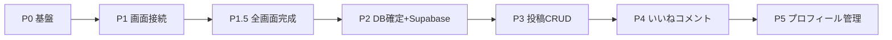

# メグリミナル 全体実装計画

Web アプリとして、ダミーデータの現状からルーティング整備とレスポンシブ対応のあと早めに Supabase を導入し、認証・投稿・いいね・コメント・管理までを段階実装する。

- スマホネイティブアプリ（React Native）は対象外
- スマホのブラウザ閲覧（レスポンシブ）は全フェーズで必須

## 前提

- データの持ち方: **画面完成後に DB を確定**。開発中は Local モード（ダミーデータ）で全画面を作り、`NEXT_PUBLIC_DATA_SOURCE` で Supabase に切り替えてテストする。
- 範囲: **Web のみ**。ただしスマホ幅での閲覧に対応する。
- コア仕様:
  - 大カテゴリは必ず1つ
  - タグは大カテゴリに依存しない横断タグ
  - **大ジャンルにつき、一人1週間に1回しか投稿できない**

## 現状

### 動いているもの

- トップ (`/`) … ヒーロー、新着、人気、検索導線、温かみデザイン
- 検索 (`/search`) … キーワード + カテゴリ + タグ
- 管理 (`/admin`) … 大カテゴリの追加・並び・表示切替（メモリ上のみ）
- ナビ、PostCard、PostForm、LoginForm などの部品

### ルート未接続

ファイル名が App Router 規則と不一致のため、ナビからのリンクが 404 になる。

| 現在のファイル | 本来の URL |
| --- | --- |
| `okini/app/create_page.tsx` | `/create` |
| `okini/app/login_page.tsx` | `/login` |
| `okini/app/post_id_page.tsx` | `/post/[id]` |

### 未実装

- データは `okini/data/dummy.ts`
- 認証
- いいねの実体（件数のダミー表示のみ）
- コメント
- 週1投稿制限

## フェーズ全体像

---

## Phase 0: 基盤（短期間）

- 画面をスマホ幅で通し確認し、ナビ・トップ・検索の崩れを直す
- 型を拡張する（コメント、いいね、ロール、投稿制限判定に必要な項目）
- 設計書の空テンプレ（要件定義・テーブル定義・API仕様）は実装と同期して埋めていく

## Phase 1: ルーティングと画面骨格

ファイルを正規パスへ移す。この時点では UI 骨格でよい。保存はまだダミーでも可。ナビのリンクが 404 にならないことを優先する。

- `/create` … 既存 PostForm を接続
- `/login` … 既存 LoginForm を接続
- `/signup`
- `/post/[id]` … 既存 PostDetail を接続
- `/post/[id]/edit`
- `/profile/[userId]`
- `/profile/edit`

## Phase 1.5: 全画面完成（Local モード）

`NEXT_PUBLIC_DATA_SOURCE=local` で開発。Repository 経由でデータにアクセス。

- いいね UI（付与・解除の見た目）
- コメント UI（一覧・投稿フォーム）
- パスワードリセット画面（UI のみ）
- タグ管理画面（admin）
- **ランキング** (`/ranking`) … 投稿・ジャンル別・ユーザー、期間フィルター
- **ブックマーク** (`/bookmarks`) … お気に入り保存
- **通報・非表示** … 投稿詳細 + admin 一括削除
- 各画面のレスポンシブ点検

この段階では DB スキーマは確定しない。画面から必要な項目を洗い出す。

## Phase 2: DB 確定と Supabase 接続

画面完成後にテーブル定義を確定し、Supabase に接続。

- `supabase/schema.sql` を確定版に更新して実行
- `NEXT_PUBLIC_DATA_SOURCE=supabase` で認証テスト
- 環境変数・RLS・トリガーの最終調整
- 詳細: `設計書/Supabaseセットアップ手順.md`、`設計書/データソース切り替え.md`

## Phase 3: 投稿 CRUD と週1制限

- 作成・編集・削除を Supabase に接続
- **大ジャンル × ユーザー × 直近7日で1件** を DB 側（制約または RPC）で強制。クライアント表示は補助
- 制限時は「このジャンルはあと○日後に投稿できます」と出す
- 下書きは初期スコープ外（必要なら後回し）

## Phase 4: いいねとコメント

- いいねの付与・解除、件数表示（トップヒーロー・カード・詳細）
- コメント一覧と投稿（ログイン必須）
- 匿名は閲覧のみ

## Phase 5: プロフィールと管理画面

- プロフィール表示・編集（名前、アバター）
- 管理画面を DB 接続: カテゴリ、タグ、ユーザー（権限）
- 一般ユーザーは `/admin` に入れない

## レスポンシブ（横断）

各画面でスマホを先に見る。

- ナビは狭い幅でアイコン中心
- 検索フィルタは縦積み
- フォームは1カラム

## 明示的に後回し

- 下書き
- パスワードリセット（画面設計にはあるが Phase 2 の後で可）
- React Native
- 通知

## 実装順の目安

1. ルート修正（ナビの 404 解消） ✅
2. Local モードで全画面完成
3. DB スキーマ確定 → Supabase 接続
4. 投稿 CRUD + 週1制限（Supabase 本接続）
5. いいね・コメント
6. プロフィール・管理の本番化
