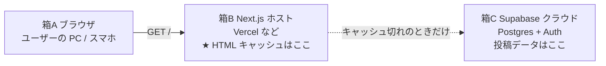
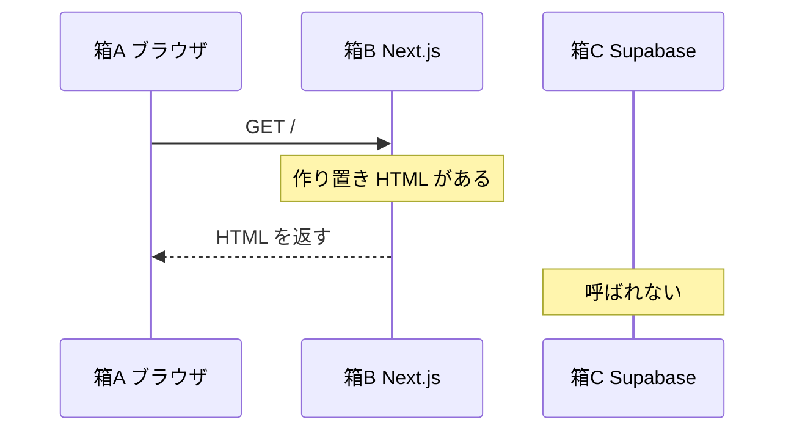
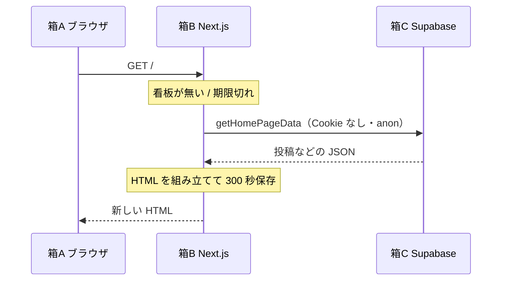
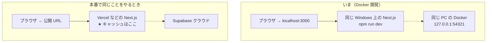

# トップのキャッシュと、プログラムが動く場所

トップ（`/`）の `revalidate = 300` が、**どの機械の、どの箱で**動くかの図です。環境の一覧は `環境構成.md`。

## たとえ

食堂の「本日のランチ看板」がキャッシュです。

- **厨房** = Supabase（投稿の本データ）
- **看板** = Next.js ホストが持っている作り置き HTML
- **客** = ブラウザ

客は厨房に入らず看板を見る。厨房を見に行くのは、看板の係（Next.js）が **5分に1回** だけです。

---

## 3つの箱（本番で同じことをやるとき）

リポジトリにデプロイ先はまだ固定していません。本番でも役割はこの3つです。

| 箱 | 何が置いてあるか | トップのキャッシュか |
|---|---|---|
| A ブラウザ | 画面。ログイン Cookie もある | 違う（トップ HTML の正本ではない） |
| B Next.js | `app/page.tsx` が動く。5分の HTML スナップショット | **ここ** |
| C Supabase | 投稿・ユーザーの行 | 違う。HTML は置かない |

Cookie は A→B に送られますが、トップは `getPublicRepository()` なので **B は Cookie を読まない**。だから「全員同じ看板」を B に置ける。

---

## HIT（5分以内の2人目以降）

箱 C には行かない。

---

## MISS（初回、または5分経過後）

コードの対応:

1. `app/page.tsx` … 箱 B で動く
2. `getPublicRepository()` → `lib/supabase/public.ts` … 箱 B から箱 C へ
3. `SupabaseDataRepository.getHomePageData()` … 箱 C の `posts` などを読む

---

## いまの開発 PC との対応

`npm run dev` では ISR が本番どおり効かないことが多いです。5分使い回しは `next build` してから `next start`、または本番ホストで初めて図どおりになります。

---

## 検索など

`/search` は作り置きしません。箱 A の JavaScript が `getRepository()` で箱 C に都度聞きます。ログイン Cookie を使うので人によって結果が違います。
