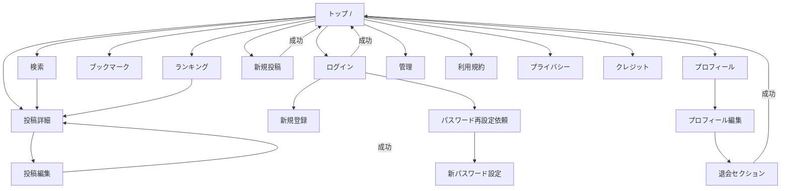

# 画面設計書

最終更新: 2026-09-14（本棚非公開 + ログインなし掲示板）

画面の見た目の正本。コードの地図は [`ソース案内.md`](../ソース案内.md)、権限・データの正本は [`詳細設計書.md`](../詳細設計/詳細設計書.md) と [`テーブル定義書.md`](../テーブル定義/テーブル定義書.md)。

文言はすべて `t('...')`（定義は `messages/ja.ts`）。ここに書くラベルは意味の説明であり、実装の文字列そのものではない。

---

## 0. 全画面共通

### 0.1. 枠

全ページは `app/layout.tsx` で次の順に包まれる。

1. `QueryProvider`（TanStack Query）
2. `LocaleProvider`（現状デフォルトは `ja`）
3. `AuthProvider`（Supabase セッション）
4. **Navbar**（sticky ヘッダー）
5. `<main>`（各ページ）
6. **Footer**

### 0.2. Navbar

左: ブック型マーク + アプリ名（`/` へ）。開発時のみ Docker / Cloud バッジ。

中央（`md` 以上）: アイコン付きピル（検索・ランキング・adminなら管理）。いまのページは塗りつぶし。本棚・保存・ログインはいったん非公開。

右: おすすめを投稿、アバターまたはログイン。狭い幅はメニュー。

| 要素 | 遷移 | 表示条件 |
| --- | --- | --- |
| 検索 | `/search` | 常時 |
| ランキング | `/ranking` | 常時 |
| ブックマーク | `/bookmarks` | いったん非公開（ナビに出さない。パスは残す） |
| 管理 | `/admin` | `profiles.role === 'admin'` のみ |
| おすすめを投稿 | `/create` | 常時（ログイン不要） |
| アバター + 表示名 | `/profile/{自分のid}` | ログイン済みのときだけ（ナビのログインは出さない） |
| ログイン | `/login` | ナビにも直打ちでも出さない（404）。実装は残す |

### 0.3. Footer

利用規約 `/terms`、プライバシー `/privacy`、クレジット `/credits`、コピーライト。

### 0.4. 権限（画面側）

ミドルウェアが未ログインの保護ページをホームへ戻す（掲示板モード）。ユーザー機能を戻したあとは `/login?redirect=元のパス`。`redirect` は同一オリジンの `/` 始まりのみ許可。

| パス | 条件 |
| --- | --- |
| `/bookmarks` `/profile/edit` `/settings` `/reset-password` | ログイン必須 |
| `/create` | ログイン不要（掲示板モード） |
| `/post/[id]/edit` | ログイン必須。所有者以外は詳細へ戻す案内 |
| `/admin` | ログイン + admin。それ以外は `/` へ |

ボタン非表示は UX 用。拒否の正本は RLS。

### 0.5. レスポンシブ

スマホ幅を先に見る。ナビは狭い幅でメニュー、検索フィルタは縦積み、フォームは1カラム。見た目の正は「日だまりの推薦室」（page `#f2eee3`、brand `#9e4e37`、明朝見出し）。一覧カードは色面＋頭文字。検索結果はホバー持ち上げなし。

---

## 1. 画面一覧

| 画面名 | URL | 概要 | 備考 |
| :--------------- | :----------------------- | :------------------------------------------- | :-------------------------------------------------- |
| トップ | `/` | ヒーロー（抽選）・新着カード・ジャンルの棚・タグ・ランキング抜粋 | 誰でも。サーバー ISR（5分） |
| 検索 | `/search` | ジャンル・タグ・期間・キーワードで絞る | 誰でも。投稿を一括取得してブラウザ側フィルタ |
| 本棚 | `/shelf` | 投稿を背表紙として棚に並べ、引き抜くと推薦メモが出る | **いったん非公開**。ナビ・トップから外し、URL 直打ちは 404。実装は `EndlessShelf` に残す |
| 投稿詳細 | `/post/[id]` | 本文・いいね・コメント | 誰でも閲覧・書き込み。匿名投稿者は「匿名」 |
| 新規投稿 | `/create` | 投稿フォーム | ログイン不要。匿名は週1制限なし |
| 投稿編集 | `/post/[id]/edit` | 同上フォーム（初期値あり） | 投稿者本人のみ |
| ログイン | `/login` | メール + Google | **いったん非公開**。ナビ・直打ちとも 404。`LoginForm` は残す |
| 新規登録 | `/signup` | 表示名・メール・パスワード + Google | |
| パスワード再設定依頼 | `/forgot-password` | リセットメール送信 | 誰でも |
| 新パスワード設定 | `/reset-password` | メールリンク後のパスワード更新 | ログイン必須（リセットセッション） |
| プロフィール | `/profile/[userId]` | アバター・投稿一覧 | 誰でも。自分なら編集・ログアウト・退会リンク |
| プロフィール編集 | `/profile/edit` | 表示名・アバター URL・退会 | ログイン本人。下部に退会セクション |
| 設定（転送） | `/settings` | `/profile/edit#delete-account` へ即リダイレクト | ログイン必須。画面としては残さない |
| ブックマーク | `/bookmarks` | 保存した投稿 | ログイン必須 |
| ランキング | `/ranking` | 投稿 / ジャンル / ユーザー | 誰でも。期間フィルタ |
| 管理 | `/admin` | 大カテゴリ CRUD + 通報対応 | admin のみ。太陽室のトークン、密度は管理向け |
| 利用規約 | `/terms` | 規約本文（ドラフト） | 誰でも |
| プライバシー | `/privacy` | プライバシーポリシー（ドラフト） | 誰でも |
| クレジット | `/credits` | アバター素材などのライセンス | 誰でも |

画面ではないが認証で使う:

| パス | 役割 |
| --- | --- |
| `GET /auth/callback` | Google OAuth 完了。`code` をセッションに交換 |

---

## 2. 画面フロー

ナビの「投稿する」は未ログインでも使える。ブックマークはナビに出さない。

---

## 3. 画面詳細

### 3.1. トップページ (`/`)

*   **概要**：入り口。サーバーで共通スナップショットを取り、クライアントでヒーローを抽選する。
*   **データ**：`getHomePageData()`（`revalidate = 300`）。閲覧者の非表示投稿はここでは除外しない（全員共通キャッシュ）。
*   **構成要素**：
    *   ヒーローコピー + 抽選した投稿の大きめ表紙。シャッフルで再抽選。詳細へ
    *   新着投稿（`PostCard` グリッド、先頭1枚 featured。検索へ「すべて見る」）
    *   人気投稿（ヒーローと重複しない最大4件）
    *   ジャンルの棚（有効な大ジャンル、`/search?major=`）
    *   統計（投稿数・いいね数・ユーザー数・有効ジャンル数）と歩き方3ステップ
    *   アプリ紹介 + タグクラウド（`/search?tag=`）とランキング上位5件（`/ranking` へ）
    *   開発時のみ、サーバーがトップデータを取った回数（ISR 確認用）
    *   キーワード検索の主導線はナビの「検索」（`/search`）

### 3.1.1. 本棚 (`/shelf`) — いったん非公開

*   **公開方針**：ナビにもトップにも出さない。`/shelf` は `notFound()`（404）。後悔しないものが揃うまで公開しない。
*   **実装**：`EndlessShelf` と文言は残してある。公開するときはページの `notFound()` を外し、ナビとトップの「本棚を歩く」を戻す。
*   **概要**：投稿をジャンルごとの棚に背表紙として並べる。引き抜くと右側（狭い幅では下）に推薦メモ。詳細へ。
*   **データ**：`usePosts` / `useMajorCategories`（検索と同じく閲覧者の非表示を除外）。
*   **構成要素**：
    *   ジャンルチップ（すべて + 投稿のある大ジャンル）
    *   横スクロールの背表紙列。高さ・幅・色は投稿 ID から固定
    *   手元カード（タイトル・推薦文・いいね・保存・詳細）

### 3.2. 検索ページ (`/search`)

*   **概要**：折りたたみ式。投稿を `usePosts` で一括取得し、`lib/search.ts` の `filterAndSortPosts` でブラウザ側フィルタ。
*   **URL クエリ（初期値に取り込む）**：`q`（キーワード）、`major`（大ジャンル ID）、`tag`（タグ ID 1つ）
*   **通常（閉じた状態）**：大ジャンル + 中ジャンル（`CategoryPicker`）
*   **詳細条件（開いた状態）**：
    *   キーワード（タイトル・本文・URL・投稿者名）
    *   タグ（複数。いずれか / すべて含む）
    *   投稿日：全期間 / 今月 / 今週、またはカレンダーの From–To
*   並び替え（新しい順 / 古い順 / いいね順）と件数は常時表示
*   選択中の条件はチップで外せる
*   検索ボタン（または Enter）で draft を applied に確定
*   結果は `PostCard`（`flat`。ホバーで持ち上がらない）
*   ログイン中は自分の非表示投稿を一覧から除く

### 3.3. 投稿詳細ページ (`/post/[id]`)

*   **概要**：個別投稿。見つからなければホームへ戻す案内。
*   **構成要素**：
    *   戻る、タイトル、説明、外部 URL（http/https のみ表示）、投稿者（プロフィールへ）、大/中ジャンル、投稿日
    *   いいね（`LikeButton`。未ログインでも付与可。同一ブラウザでは二重押ししない）
    *   ブックマーク（ログイン時のみ。掲示板モードではボタン自体を出さない）
    *   本人: 編集・削除（確認ダイアログ。削除後は自分のプロフィールへ）。匿名投稿には出ない
    *   ログイン済み・他人: 通報（理由 + 詳細）・非表示（自分のフィードからだけ消す。実行後ホームへ）
    *   コメント（`CommentSection`）
        *   一覧。本人は編集・削除、admin は削除のみ。匿名コメントは編集不可
        *   投稿フォームは誰でも（1〜1000 文字）。表示名は「匿名」

### 3.4. 新規投稿作成ページ (`/create`)

*   **概要**：`PostForm`（`initialPost` なし）。
*   **構成要素**：
    *   大ジャンル（必須）+ 中ジャンル（その大ジャンルに子があるときだけ）
    *   タイトル（必須、最大100）
    *   説明（必須、最大1000）
    *   URL（任意、http/https）
    *   投稿ボタン
*   **投稿制限**：ログイン中だけ送信前に `checkPostFrequency`。匿名投稿は週1の対象外。DB トリガーも `user_id is null` なら通す。
*   **未接続**：タグ選択 UI はまだない（型・repository・検索側は `tagIds` 対応済み）。

### 3.5. 投稿編集ページ (`/post/[id]/edit`)

*   **概要**：同じ `PostForm` に `initialPost` を渡す。週1制限は新規のみ。
*   **構成要素**：既存値が入ったフィールド、更新、失敗時は詳細へ戻す案内。
*   他人・未ログイン（ミドルウェア通過後の本人チェック失敗）: 「編集できません」+ 詳細へ。

### 3.6. ログインページ (`/login`)

*   **概要**：メール + パスワード、または Google。
*   **構成要素**：
    *   Google ボタン（Supabase OAuth → `/auth/callback`）
    *   メール、パスワード
    *   ログインボタン
    *   新規登録、パスワードを忘れた
*   `?redirect=` 成功後の戻り先。危険な値は `/`
*   `?error=auth_callback` OAuth 失敗メッセージ
*   `?reset=success` パスワード更新後の案内

入力はメールアドレス（ユーザー名ログインは無い）。

### 3.7. 新規登録ページ (`/signup`)

*   **構成要素**：Google、表示名、メール、パスワード、パスワード確認、登録、ログインへのリンク。
*   パスワードは 6 文字以上。確認メールが必要な環境では送信案内を出してトップへ飛ばさない。

### 3.8. パスワード再設定依頼 (`/forgot-password`)

*   **構成要素**：メール入力、送信。成功後は「メールを確認」とログインへ戻るリンク。
*   実処理は `supabase.auth.resetPasswordForEmail`（戻り先 `/reset-password`）。

### 3.9. 新パスワード設定 (`/reset-password`)

*   **概要**：メールリンクでセッションが付いた状態で新しいパスワードを入れる。
*   **構成要素**：新パスワード、確認、更新。成功後 `/login?reset=success`。
*   未ログインはミドルウェアで `/login` へ。

### 3.10. プロフィールページ (`/profile/[userId]`)

*   **構成要素**：
    *   アバター、表示名、投稿数
    *   その人の投稿一覧（`PostCard`。閲覧者の非表示を除外）
    *   本人のみ: プロフィール編集、ログアウト、退会（`/profile/edit#delete-account`）
*   ユーザーがいなければホームへ。

### 3.11. プロフィール編集 (`/profile/edit`)

*   **構成要素**：
    *   基本情報: アバタープレビュー、表示名、アバター URL（ファイルアップロードではない）
    *   メールは表示のみ（Auth 側。ここでは変えない）
    *   保存 / キャンセル（プロフィールへ戻る）
    *   下部: 退会セクション（`DeleteAccountSection`、`id="delete-account"`）
*   アバター未設定時はユーザー ID から `public/avatars/000.svg`〜`099.svg` を安定割り当て。

### 3.12. 設定 (`/settings`)

独立 UI は無い。マウント後に `/profile/edit#delete-account` へ `replace`。古いリンク・退会設計書の入口用。

### 3.13. ブックマーク (`/bookmarks`)

*   ログイン済み: 保存投稿をグリッド表示。空なら検索へ。
*   ミドルウェア前にクライアントが未ログインを描画した場合の誘導もある（`/login?redirect=/bookmarks`）。

### 3.14. ランキング (`/ranking`)

*   **タブ**: 総合投稿 / ジャンル別 / ユーザー
*   **期間**: 全期間 / 今月 / 今週（`PeriodFilter`。直近 30 日 / 7 日）
*   ジャンル別: 有効な大カテゴリのドロップダウン
*   ユーザー: 獲得いいね数 / 投稿数
*   行クリックで投稿詳細またはプロフィールへ

全期間の投稿ランキングは `posts.like_count`。週/月は期間内の `likes` を集計。

### 3.15. 管理画面 (`/admin`)

ダークテーマ。タブは2つ。

*   **カテゴリ**: 大ジャンルの追加（名前 + Lucide アイコン）、並び替え、表示/非表示、削除（投稿が残っているとアプリ層で拒否）
*   **通報**: `AdminModeration`。未対応通報の確認、対象投稿の一括削除、通報の解決

**未接続**: タグ CRUD、ユーザー一覧・権限変更。admin 昇格は SQL Editor。

### 3.16. 法務・クレジット

`LegalPageShell` 共通枠（タイトル、本文、ホームへ戻る）。

*   `/terms` `lib/legal/terms-sections.ts`（ドラフト。公開前に法務確認）
*   `/privacy` `lib/legal/privacy-sections.ts`（同上。退会後の削除方針を含む）
*   `/credits` DiceBear 由来のデフォルトアバターと、その他素材のライセンス一覧

### 3.17. 通報・非表示（投稿詳細内）

独立 URL は無い。

*   通報: 理由 `spam` / `inappropriate` / `misinformation` / `other` + 任意詳細。同一投稿は upsert
*   非表示: 自分の一覧・検索・プロフィール投稿一覧から消す。投稿本体は残る
*   admin は `/admin` の通報タブで一括削除

### 3.18. 退会（プロフィール編集内）

詳細は [`退会処理設計.md`](../詳細設計/退会処理設計.md)。

*   折りたたみ。展開後に影響説明、確認チェック
*   メールユーザー: 現在のパスワード
*   Google のみ: 確認フレーズ `退会する`
*   成功後トップへ（`/?deleted=1`）

---

## 4. 共通部品（画面からよく触る）

| 部品 | 役割 |
| --- | --- |
| `PostCard` | 一覧カード。タイトル・投稿者・いいね数・ジャンル |
| `PostForm` | 新規・編集の入力 |
| `LikeButton` / `BookmarkButton` | 投稿詳細の操作 |
| `UserAvatar` | 画像 URL またはデフォルト SVG |
| `CategoryPicker` | 大 + 中ジャンル |
| `SearchPeriodFilter` / `PeriodFilter` / `DatePicker` | 期間 |
| `GoogleSignInButton` | OAuth |

---

## 5. 実装との差分（設計上あるが UI 未接続）

| 項目 | 状態 |
| --- | --- |
| 投稿フォームのタグ選択 | 未接続。検索・DB は対応済み |
| 管理のタグ CRUD | 未接続 |
| 管理のユーザー権限変更 | 未接続（SQL で `role` 更新） |
| アバターのファイルアップロード | 未接続（URL 文字列） |
| 下書き・通知 | スコープ外 |
| `/settings` 本体 | 退会はプロフィール編集へ集約 |
| 本棚 `/shelf` | いったん非公開（404）。実装は残す |
| ログイン導線 | いったん非公開。`PUBLIC_BOARD`。実装は残す |
