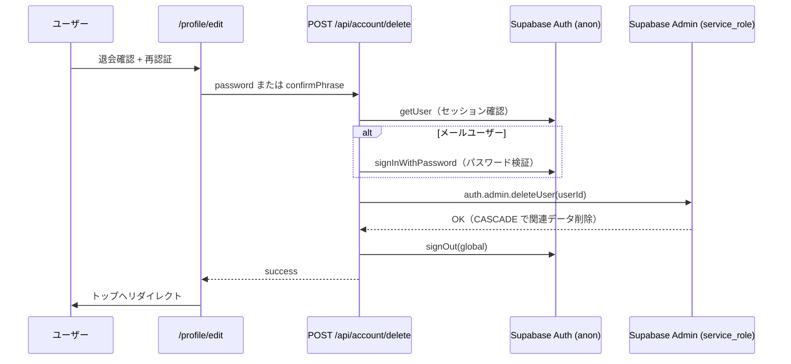

# 退会処理設計

本番リリース前に確定したアカウント削除（退会）の方針。

## 方針サマリ

| 項目 | 決定 |
| --- | --- |
| 削除方式 | **物理削除**（`auth.admin.deleteUser`） |
| プロフィール・投稿・いいね・コメント・ブックマーク | **CASCADE で削除**（既存スキーマどおり） |
| 匿名化 | 行わない（退会後は痕跡を残さない） |
| 再登録クールダウン | 設けない（同一メールで新規登録可能） |
| 実行場所 | Next.js API Route（サーバーのみ `service_role`） |
| 本人確認 | メールユーザー: パスワード再入力 / OAuth ユーザー: 確認フレーズ `退会する` |
| Google 連携 | `deleteUser` により Identity ごと削除 |

## 理由

- スキーマがすでに `on delete cascade` で統一されている
- 匿名化は UI・RLS・表示ロジックの追加コストが大きい
- `service_role` はクライアントに載せず、API Route 経由のみ

## フロー

## 環境変数

| 変数 | 用途 |
| --- | --- |
| `SUPABASE_SERVICE_ROLE_KEY` | サーバー専用。`.env.local` に設定。Git に含めない |

ローカル: `npm run supabase:status` の `service_role key` を使用。

## 画面

退会 UI の実体は **プロフィール編集の下部**。`/settings` は残しているが独立画面ではなく転送する。

| 入口 | 挙動 |
| --- | --- |
| `/profile/edit#delete-account` | `DeleteAccountSection`（確認・再認証・実行） |
| `/profile/[自分]` の「退会」リンク | 上記ハッシュへ |
| `/settings` | マウント後に `/profile/edit#delete-account` へ `replace` |

UI: `components/settings/DeleteAccountSection.tsx`  
API: `app/api/account/delete/route.ts`

成功後は `/?deleted=1` へ。

## 法務との整合

- 利用規約第7条: プロフィール編集（`/profile/edit`）から退会可能。`/settings` は同箇所へ転送
- プライバシーポリシー: 退会後は関連データを削除（バックアップは Supabase 側の保管期間に従う）

## 将来の拡張（今回は対象外）

- 退会前のデータエクスポート
- 再登録クールダウン
- 論理削除 + 「退会済みユーザー」表示
